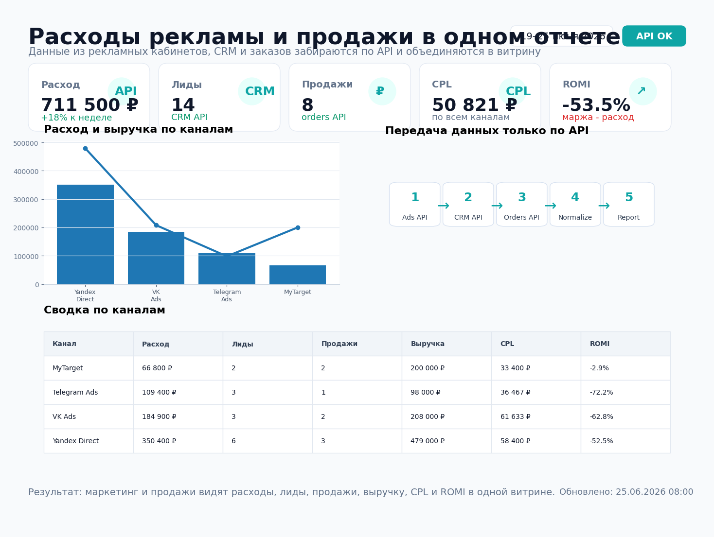
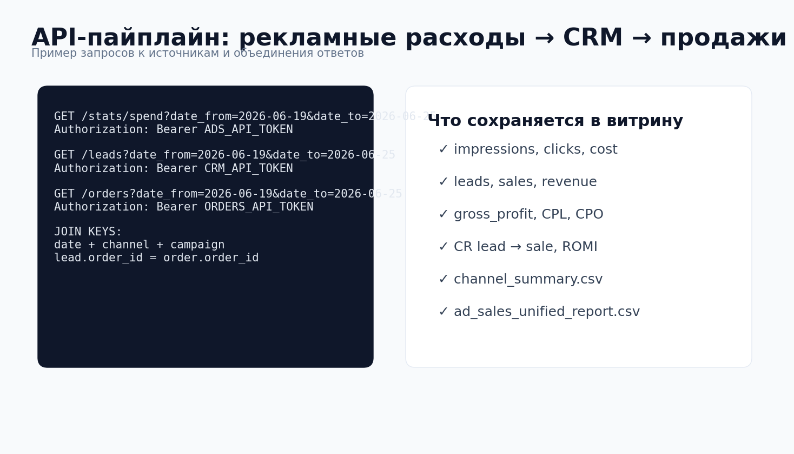
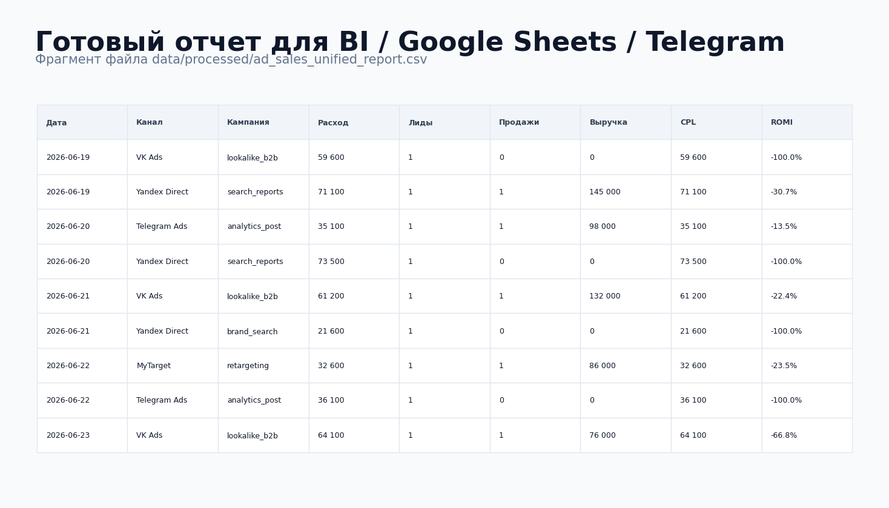

# Расходы рекламы и продажи в одном отчете



## Задача

Данные по рекламе, заявкам и продажам лежали в разных системах: рекламные кабинеты, CRM и заказы/оплаты.  
Из-за этого было сложно быстро понять, какие каналы действительно приносят продажи, а какие только расходуют бюджет.

Нужно было собрать единый отчет, где расходы, лиды, продажи, выручка, CPL, CPO и ROMI считаются автоматически. Все передачи данных в проекте сделаны через API.

## Какие боли закрывает

- маркетинг видит расходы, но не видит продажи;
- продажи видят сделки, но не видят стоимость привлечения;
- ручные выгрузки из рекламных кабинетов занимают время;
- UTM-метки и кампании приходится сводить вручную;
- сложно быстро отключить неэффективные кампании;
- невозможно нормально считать CPL, CPO и ROMI без объединения данных.

## Что делает проект

Пайплайн `src/pipeline.py`:

1. забирает расходы из Ads API;
2. забирает лиды и статусы из CRM API;
3. забирает оплаченные заказы из Orders API;
4. нормализует даты, каналы и кампании;
5. связывает лиды с заказами по `order_id`;
6. считает показы, клики, расход, лиды, продажи, выручку и маржу;
7. рассчитывает CTR, CPL, CPO, CR lead → sale и ROMI;
8. сохраняет готовую витрину для BI, Google Sheets или Telegram.

## Результат на демо-данных

| Метрика | Значение |
|---|---:|
| Источников по API | 3 |
| Каналов рекламы | 4 |
| Строк в итоговой витрине | 14 |
| Готовая сводка по каналам | Да |
| Mock-режим без токенов | Да |
| Расписание GitHub Actions | Да |

## Структура проекта

```text
ad_sales_report_api/
├── README.md
├── requirements.txt
├── .env.example
├── data/
│   ├── mock_api/
│   │   ├── ad_spend.json
│   │   ├── crm_leads.json
│   │   └── orders.json
│   └── processed/
│       ├── ad_sales_unified_report.csv
│       └── channel_summary.csv
├── src/
│   ├── api_clients.py
│   ├── pipeline.py
│   └── export_to_telegram.py
├── sql/
│   └── ad_sales_report_clickhouse.sql
├── assets/
│   ├── report_preview.png
│   ├── api_pipeline_preview.png
│   └── report_table_preview.png
├── tests/
│   └── test_pipeline.py
└── .github/
    └── workflows/
        └── ad_sales_report.yml
```

## Быстрый запуск

```bash
pip install -r requirements.txt
python src/pipeline.py --date-from 2026-06-19 --date-to 2026-06-25
python src/export_to_telegram.py
```

По умолчанию включен `MOCK_MODE=1`, поэтому проект запускается без реальных API-токенов и читает примеры ответов из `data/mock_api/`.

## Переменные окружения

```text
MOCK_MODE=1

ADS_API_URL=https://ads-api.example.com
ADS_API_TOKEN=token

CRM_API_URL=https://crm.example.com/api
CRM_API_TOKEN=token

ORDERS_API_URL=https://shop.example.com/api
ORDERS_API_TOKEN=token

TELEGRAM_BOT_TOKEN=123456:telegram-token
TELEGRAM_CHAT_ID=123456789
```

## API-передача данных



## Пример готовой витрины



## Ключевые метрики

- `cost` — расходы по рекламному кабинету;
- `leads` — заявки из CRM;
- `sales` — выигранные сделки / оплаченные заказы;
- `revenue` — выручка из системы заказов;
- `gross_profit` — валовая прибыль;
- `cpl` — стоимость лида;
- `cpo` — стоимость продажи;
- `cr_lead_to_sale` — конверсия лида в продажу;
- `romi` — окупаемость рекламы по марже.

## Что можно доработать в реальном проекте

- подключить реальные API Яндекс Директа, VK Ads, Telegram Ads;
- подключить amoCRM, Bitrix24 или кастомную CRM;
- отправлять ежедневную сводку в Telegram;
- загружать витрину в ClickHouse;
- строить дашборд в DataLens, Power BI или Looker Studio;
- добавить контроль UTM-меток и алерты по росту CPL.

## Стек

- Python
- httpx
- pandas
- API integrations
- ClickHouse SQL
- Telegram Bot API
- GitHub Actions
