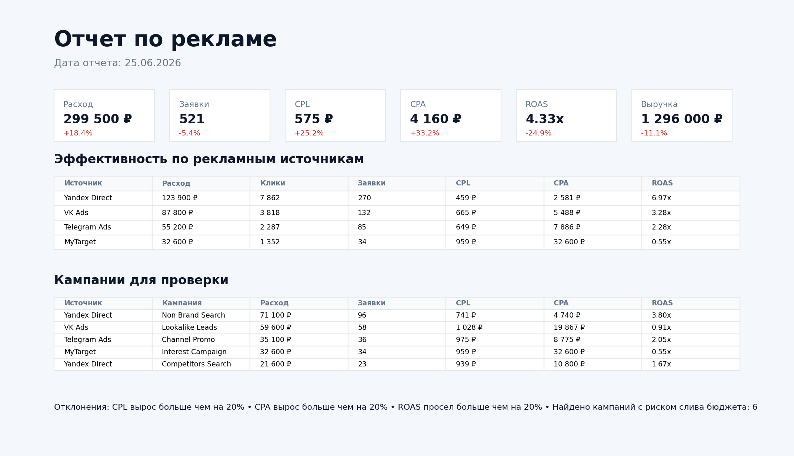

# Отчет по рекламе

## Описание проекта

Проект демонстрирует автоматизацию ежедневной маркетинговой отчетности по рекламным кампаниям.

Скрипт каждый день собирает расходы, показы, клики, заявки, заказы и выручку, считает ключевые KPI, сравнивает показатели с предыдущим днем, формирует HTML/PNG-отчет и может отправлять его в Telegram или Email.

---

# Бизнес-задача

У клиента рекламная отчетность собиралась вручную из нескольких источников:

- рекламные кабинеты показывали расходы, клики и показы;
- CRM показывала заявки, заказы и выручку;
- аналитик сводил данные в Excel;
- руководитель получал отчет уже после начала рабочего дня;
- неэффективные кампании продолжали тратить бюджет, пока их не проверят вручную.

Задача — сделать автоматический отчет по рекламе, который утром показывает эффективность каналов и подсвечивает кампании, где растут CPL/CPA или падает ROAS.

---

# Что было реализовано

Python-скрипт по расписанию:

- забирает рекламные данные из CSV или витрины;
- объединяет расходы с заявками, заказами и выручкой;
- считает CTR, CPC, CPL, CPA, конверсии и ROAS;
- сравнивает показатели с предыдущим днем;
- строит отчет по рекламным источникам;
- находит кампании с риском слива бюджета;
- сохраняет HTML-отчет и PNG-скрин;
- при необходимости отправляет отчет в Telegram или Email.

---

# Скрин отчета



---

# Пример результата

В ежедневный отчет попадают основные KPI:

- расход;
- заявки;
- CPL;
- CPA;
- ROAS;
- выручка;
- эффективность по рекламным источникам;
- кампании для проверки;
- автоматические предупреждения по отклонениям.

Пример уведомления:

```text
Отчет по рекламе за 25.06.2026

Расход: 299 500 ₽ (+18.4% к прошлому дню)
Заявки: 521 (-5.4% к прошлому дню)
CPL: 575 ₽ (+25.2% к прошлому дню)
CPA: 4 160 ₽ (+33.2% к прошлому дню)
ROAS: 4.33x (-24.9% к прошлому дню)
Выручка: 1 296 000 ₽ (-11.1% к прошлому дню)

Отклонения:
- CPL вырос больше чем на 20%
- CPA вырос больше чем на 20%
- ROAS просел больше чем на 20%
- Найдено кампаний с риском слива бюджета: 6
```

---

# Какие боли закрывает решение

## 1. Не нужно вручную сводить рекламные кабинеты и CRM

Расходы, клики и показы можно брать из рекламных систем, а заявки, заказы и выручку — из CRM или базы данных. Скрипт собирает все в один отчет.

## 2. Быстро видно, где растет стоимость заявки

CPL и CPA считаются автоматически по каждому источнику и кампании. Если стоимость заявки или заказа резко выросла, отчет сразу подсвечивает проблему.

## 3. Бюджет не сливается незаметно

Система находит кампании, где есть высокий расход, но мало заказов, высокий CPA или низкий ROAS.

## 4. Руководитель видит маркетинг в деньгах

Отчет показывает не только рекламные метрики вроде кликов и CTR, но и бизнес-результат: заявки, заказы, выручку и окупаемость.

## 5. Один формат отчета для маркетолога и собственника

Все участники смотрят на одинаковые цифры, без разных версий Excel и ручных пересчетов.

## 6. Решение легко масштабировать

Вместо CSV можно подключить ClickHouse, PostgreSQL, Google Sheets, API рекламных кабинетов или CRM.

---

# Как работает система

## 1. Получение данных

В демо-проекте используется файл:

```text
data/ads_daily.csv
```

В реальном проекте источник можно заменить на:

- Яндекс Директ;
- VK Ads;
- Telegram Ads;
- CRM;
- Google Sheets;
- ClickHouse;
- PostgreSQL;
- готовую маркетинговую витрину данных.

## 2. Расчет метрик

Скрипт считает показатели за выбранный день и сравнивает их с предыдущим днем.

Основная логика находится в файле:

```text
src/advertising_report.py
```

## 3. Формирование отчета

На выходе создаются файлы:

```text
reports/advertising_report_YYYY-MM-DD.html
reports/advertising_report_YYYY-MM-DD.png
```

## 4. Отправка отчета

Если заполнены переменные окружения, отчет можно отправить:

- в Telegram;
- на Email.

## 5. Запуск по расписанию

Для автоматического ежедневного запуска добавлен пример GitHub Actions workflow:

```text
.github/workflows/advertising_report.yml
```

---

# Технический стек

- Python
- Pandas
- Matplotlib
- Requests
- SMTP
- Telegram Bot API
- GitHub Actions
- CSV / SQL / рекламные кабинеты / CRM-источник данных

---

# Структура проекта

```text
.
├── README.md
├── requirements.txt
├── .env.example
├── data
│   └── ads_daily.csv
├── src
│   └── advertising_report.py
├── sql
│   └── advertising_report_clickhouse.sql
├── assets
│   └── report_preview.png
├── reports
│   ├── advertising_report_2026-06-25.html
│   └── advertising_report_2026-06-25.png
└── .github
    └── workflows
        └── advertising_report.yml
```

---

# Запуск проекта

## 1. Установить зависимости

```bash
pip install -r requirements.txt
```

## 2. Запустить отчет на демо-данных

```bash
python src/advertising_report.py \
  --data data/ads_daily.csv \
  --output-dir reports
```

## 3. Запустить отчет за конкретную дату

```bash
python src/advertising_report.py \
  --data data/ads_daily.csv \
  --output-dir reports \
  --report-date 2026-06-25
```

## 4. Отправить отчет в Telegram

Сначала заполнить `.env` по примеру `.env.example`, затем запустить:

```bash
python src/advertising_report.py \
  --data data/ads_daily.csv \
  --output-dir reports \
  --send-telegram
```

## 5. Отправить отчет на Email

```bash
python src/advertising_report.py \
  --data data/ads_daily.csv \
  --output-dir reports \
  --send-email
```

---

# Где применяется

Такой отчет подходит для:

- performance-маркетинга;
- интернет-магазинов;
- лидогенерации;
- агентств;
- B2B-сервисов;
- проектов, где важно ежедневно контролировать стоимость заявки и окупаемость рекламы.

---

# Возможное развитие проекта

- подключить API Яндекс Директ и VK Ads;
- забрать заявки и продажи из CRM;
- добавить алерты по кампаниям в Telegram;
- добавить недельные и месячные срезы;
- добавить прогноз перерасхода бюджета;
- отправлять отдельный список кампаний, которые нужно отключить или проверить.
