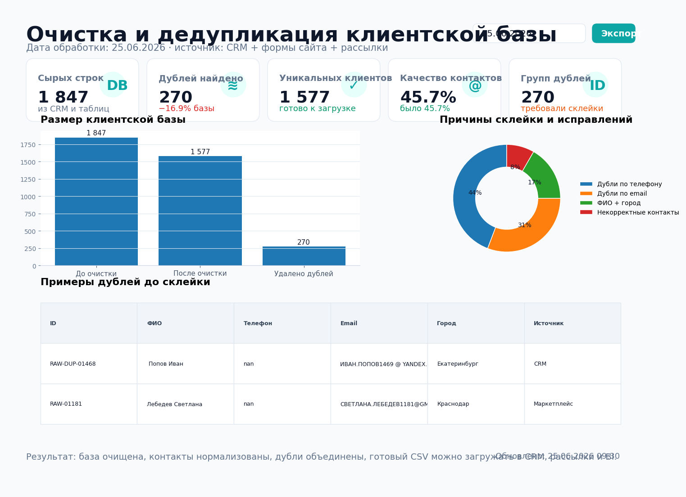
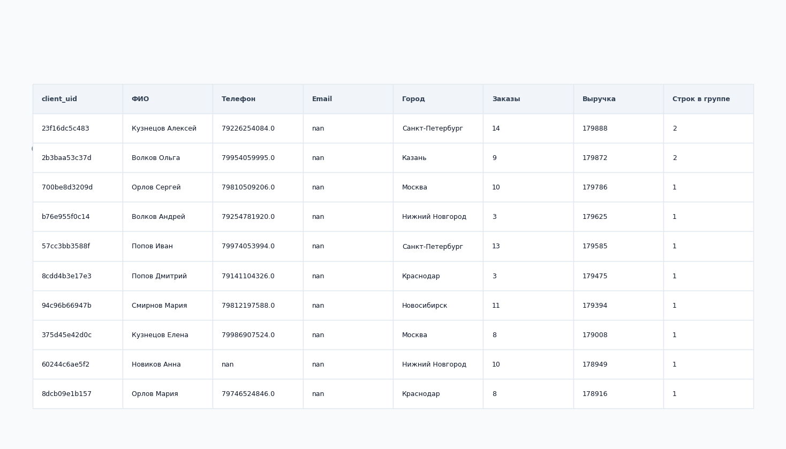

# Очистка и дедупликация клиентской базы



## Задача

В клиентской базе были дубли, разные форматы телефонов, email с пробелами и разным регистром, пустые поля и записи из нескольких источников: CRM, формы сайта, рассылки и офлайн-продажи.

Нужно было подготовить чистый список клиентов для CRM, рассылок и аналитики, чтобы один клиент не считался несколько раз в отчетах и не получал повторные коммуникации.

## Какие боли закрывает

- один и тот же клиент попадал в CRM несколько раз;
- отчеты завышали количество клиентов и повторных покупок;
- рассылки могли уходить дублями на одного человека;
- менеджеры тратили время на ручную проверку контактов;
- в дашбордах были некорректные сегменты из-за грязных телефонов и email.

## Что делает проект

Скрипт `src/clean_client_base.py`:

1. нормализует телефоны к формату `+7XXXXXXXXXX`;
2. чистит email: пробелы, регистр, простая валидация;
3. стандартизирует ФИО и города;
4. строит ключ дедупликации по приоритету: телефон → email → ФИО + город;
5. выбирает мастер-запись внутри группы дублей;
6. сохраняет чистый датасет и отчет по найденным дублям.

## Результат на демо-данных

| Метрика | Значение |
|---|---:|
| Строк в сырой базе | 1,847 |
| Уникальных клиентов после очистки | 1,577 |
| Найдено дублей | 270 |
| Групп дублей | 270 |
| Качество контактов до очистки | 45.7% |
| Качество контактов после очистки | 45.7% |

## Структура проекта

```text
client_base_cleanup/
├── README.md
├── requirements.txt
├── data/
│   ├── raw/
│   │   └── clients_dirty.csv
│   └── processed/
│       ├── clients_clean.csv
│       ├── duplicate_groups.csv
│       ├── duplicate_records_raw.csv
│       ├── quality_summary.csv
│       └── data_dictionary.csv
├── src/
│   ├── create_demo_data.py
│   ├── clean_client_base.py
│   └── make_preview.py
├── sql/
│   └── client_cleanup_clickhouse.sql
├── assets/
│   ├── report_preview.png
│   └── clean_dataset_sample.png
└── .github/
    └── workflows/
        └── client_base_cleanup.yml
```

## Быстрый запуск

```bash
pip install -r requirements.txt

python src/create_demo_data.py
python src/clean_client_base.py --input data/raw/clients_dirty.csv --output-dir data/processed
python src/make_preview.py
```

## Выходные файлы

- `data/processed/clients_clean.csv` — готовая клиентская база для CRM, рассылок и BI;
- `data/processed/duplicate_groups.csv` — группы дублей и выбранная мастер-запись;
- `data/processed/duplicate_records_raw.csv` — сырые строки, попавшие в группы дублей;
- `data/processed/quality_summary.csv` — сводка качества до и после обработки;
- `data/processed/data_dictionary.csv` — описание полей готового датасета.

## Пример готового датасета



## Логика дедупликации

Приоритеты выбраны так, чтобы сначала использовать наиболее надежные идентификаторы:

```text
phone_clean → email_clean → full_name_clean + city_clean
```

Если в группе дублей есть несколько строк, мастер-запись выбирается по полноте данных, свежести последнего заказа и сумме выручки.

## Стек

- Python
- pandas
- регулярные выражения
- matplotlib
- ClickHouse SQL
- GitHub Actions

## Что можно доработать в реальном проекте

- подключить выгрузку из CRM/API;
- добавить fuzzy matching по ФИО и адресу;
- учитывать дату рождения или внутренний ID клиента;
- выгружать результат обратно в CRM;
- отправлять отчет по дублям в Telegram или Email.
