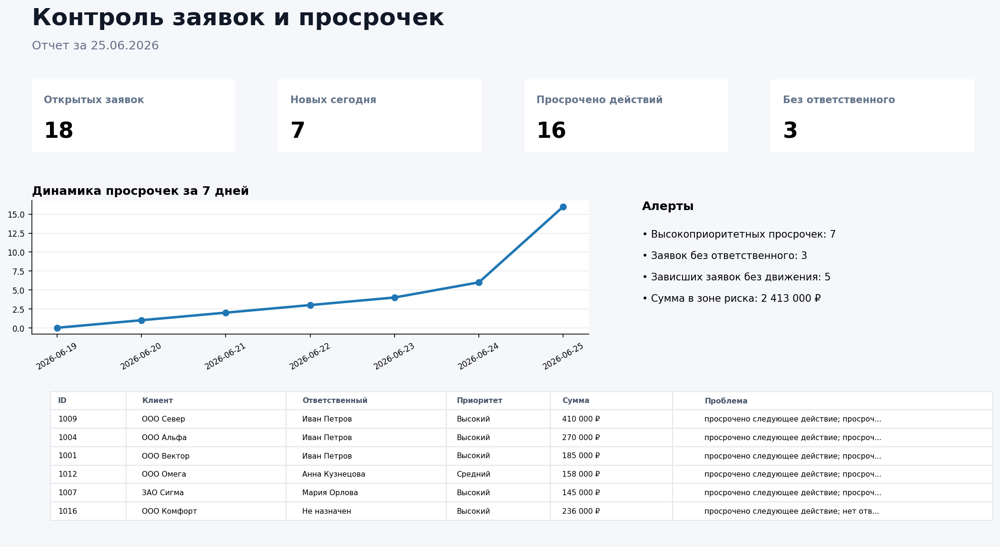

# Контроль заявок и просрочек

## Описание проекта

Проект демонстрирует автоматизацию контроля заявок в CRM.

Скрипт каждый день проверяет открытые заявки, просроченные действия, заявки без ответственных, зависшие статусы и сделки с риском потери. На выходе формируется HTML/PNG-отчет, CSV со списком проблемных заявок и краткое уведомление для Telegram или Email.

---

# Бизнес-задача

У клиента заявки контролировались вручную: менеджеры вели статусы в CRM, руководитель периодически открывал воронку и проверял, где есть просрочки.

Из-за ручного контроля возникали типовые проблемы:

- новые заявки могли долго висеть без ответственного;
- менеджеры забывали про следующее действие;
- горячие заявки просрочивались и уходили конкурентам;
- руководитель узнавал о проблеме только после жалобы клиента;
- сложно было быстро понять, у какого менеджера накопились просрочки;
- не было единого утреннего отчета по рискам в продажах.

Задача — сделать автоматический контроль CRM, который сам находит проблемные заявки и каждое утро отправляет список того, что нужно проверить в первую очередь.

---

# Что было реализовано

Python-скрипт по расписанию:

- читает выгрузку заявок из CRM;
- определяет открытые заявки;
- находит просроченные следующие действия;
- находит заявки с просроченным дедлайном закрытия;
- проверяет заявки без ответственного менеджера;
- находит зависшие статусы без движения несколько дней;
- выделяет высокоприоритетные просрочки;
- считает сумму сделок в зоне риска;
- формирует HTML-отчет;
- сохраняет PNG-скрин отчета;
- выгружает CSV со списком проблемных заявок;
- может отправлять краткое уведомление в Telegram или Email.

---

# Скрин отчета



---

# Пример результата

В ежедневный отчет попадают основные показатели:

- открытые заявки;
- новые заявки за день;
- просроченные действия;
- просроченные дедлайны закрытия;
- заявки без ответственного;
- зависшие заявки;
- сумма сделок в зоне риска;
- проблемные заявки с причиной попадания в отчет;
- нагрузка и просрочки по менеджерам.

Пример уведомления:

```text
Контроль заявок и просрочек за 25.06.2026

Открытых заявок: 18
Новых сегодня: 7
Просрочено действий: 16
Просрочено закрытий: 5
Без ответственного: 3
Сумма в зоне риска: 2 413 000 ₽

Что проверить:
- Высокоприоритетных просрочек: 7
- Заявок без ответственного: 3
- Зависших заявок без движения: 5
- Сумма в зоне риска: 2 413 000 ₽
```

---

# Какие боли закрывает решение

## 1. Руководителю не нужно вручную открывать CRM

Система сама проверяет заявки и показывает только проблемные кейсы. Не нужно каждый день руками фильтровать статусы, дедлайны и менеджеров.

## 2. Новые заявки не теряются

Если заявка создана, но ей не назначили ответственного, она сразу попадает в отчет. Это снижает риск потери лида на первом касании.

## 3. Просрочки становятся видны утром

Отчет показывает заявки, где уже просрочено следующее действие или дедлайн закрытия. Менеджер может быстро понять, что нужно обработать в первую очередь.

## 4. Горячие заявки контролируются отдельно

Высокоприоритетные заявки с просрочкой подсвечиваются как отдельный риск. Это помогает не терять крупные сделки.

## 5. Видно, у кого накопились проблемы

Отчет строит срез по менеджерам: сколько открыто заявок, сколько просрочено действий, сколько зависло и какая сумма находится в работе.

## 6. Можно быстро масштабировать под реальную CRM

В демо используется CSV, но источник можно заменить на Битрикс24, amoCRM, RetailCRM, Google Sheets, PostgreSQL, ClickHouse или другую базу.

---

# Как работает система

## 1. Получение данных

В демо-проекте используется файл:

```text
data/crm_requests.csv
```

В реальном проекте источником может быть:

- CRM;
- Google Sheets;
- Excel-выгрузка;
- PostgreSQL;
- ClickHouse;
- API Битрикс24;
- API amoCRM;
- внутренняя база заявок.

## 2. Проверка правил

Скрипт проверяет каждую открытую заявку по нескольким условиям:

- наступил дедлайн следующего действия;
- наступил дедлайн закрытия;
- не назначен менеджер;
- статус не менялся больше заданного количества дней;
- заявка имеет высокий приоритет.

Основная логика находится в файле:

```text
src/crm_control_report.py
```

## 3. Формирование отчета

На выходе создаются файлы:

```text
reports/crm_control_report_YYYY-MM-DD.html
reports/crm_control_report_YYYY-MM-DD.png
reports/crm_problem_cases_YYYY-MM-DD.csv
```

## 4. Отправка отчета

Если заполнены переменные окружения, отчет можно отправить:

- в Telegram;
- на Email.

## 5. Запуск по расписанию

Для автоматического ежедневного запуска добавлен пример GitHub Actions workflow:

```text
.github/workflows/crm_control_report.yml
```

---

# Технический стек

- Python
- Pandas
- Matplotlib
- Requests
- SMTP
- Telegram Bot API
- GitHub Actions
- CSV / SQL / CRM-источник данных

---

# Структура проекта

```text
.
├── README.md
├── requirements.txt
├── .env.example
├── data
│   └── crm_requests.csv
├── src
│   └── crm_control_report.py
├── sql
│   └── crm_control_clickhouse.sql
├── assets
│   └── report_preview.png
├── reports
│   ├── crm_control_report_2026-06-25.html
│   ├── crm_control_report_2026-06-25.png
│   └── crm_problem_cases_2026-06-25.csv
└── .github
    └── workflows
        └── crm_control_report.yml
```

---

# Запуск проекта

## 1. Установить зависимости

```bash
pip install -r requirements.txt
```

## 2. Запустить отчет на демо-данных

```bash
python src/crm_control_report.py \
  --data data/crm_requests.csv \
  --output-dir reports
```

## 3. Запустить отчет за конкретную дату

```bash
python src/crm_control_report.py \
  --data data/crm_requests.csv \
  --output-dir reports \
  --report-date 2026-06-25
```

## 4. Изменить правило зависшей заявки

По умолчанию заявка считается зависшей, если статус не менялся больше 3 дней.

```bash
python src/crm_control_report.py \
  --data data/crm_requests.csv \
  --output-dir reports \
  --stale-days 5
```

## 5. Отправить отчет в Telegram

Сначала заполнить `.env` по примеру `.env.example`, затем запустить:

```bash
python src/crm_control_report.py \
  --data data/crm_requests.csv \
  --output-dir reports \
  --send-telegram
```

## 6. Отправить отчет на Email

```bash
python src/crm_control_report.py \
  --data data/crm_requests.csv \
  --output-dir reports \
  --send-email
```

---

# Где применяется

Такой контроль подходит для:

- отделов продаж;
- сервисных команд;
- B2B-заявок;
- интернет-магазинов;
- агентств;
- CRM-воронок с SLA;
- проектов, где важно быстро реагировать на новые заявки и не терять сделки.

---

# Возможное развитие проекта

- подключить API Битрикс24 или amoCRM;
- добавить разные SLA по источникам и приоритетам;
- отправлять отдельные уведомления менеджерам;
- добавить недельную динамику по просрочкам;
- добавить прогноз потери выручки;
- добавить дашборд в DataLens или Power BI;
- сохранять историю просрочек в ClickHouse.
