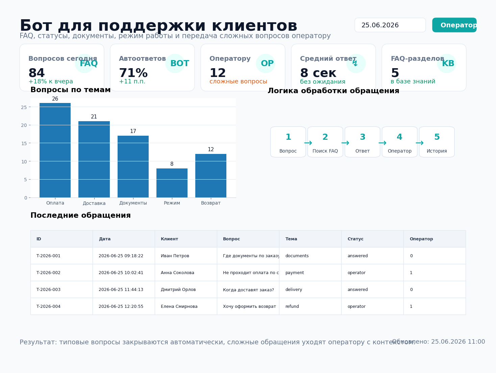
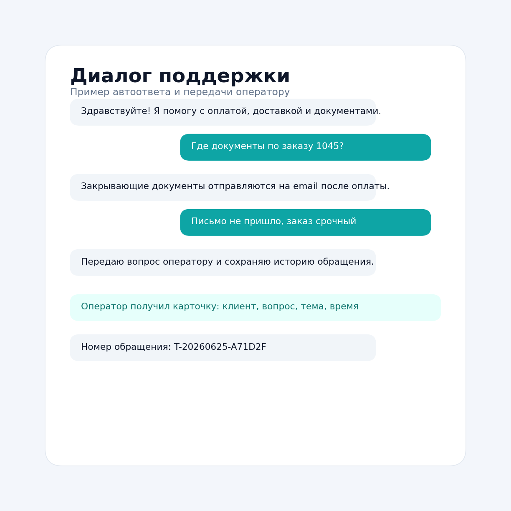

# Бот для поддержки клиентов



## Задача

Клиенты часто пишут одни и те же вопросы: как оплатить, где документы, когда доставка, какой режим работы, как оформить возврат.  
Менеджеры и операторы тратят время на повторяющиеся ответы, а сложные вопросы теряются без контекста.

Нужно было сделать бота поддержки, который отвечает на типовые вопросы из базы знаний и передает сложные обращения оператору.

## Какие боли закрывает

- оператор не отвечает вручную на одинаковые FAQ-вопросы;
- клиент получает быстрый ответ без ожидания менеджера;
- сложный вопрос передается оператору вместе с темой и историей;
- все обращения сохраняются в единую таблицу;
- можно строить аналитику по темам, каналам и доле автоответов.

## Что делает проект

Бот:

1. принимает вопрос клиента;
2. ищет подходящий ответ в `data/faq.csv`;
3. определяет тему обращения;
4. отвечает автоматически, если уверен в результате;
5. передает вопрос оператору, если уверенность низкая или клиент просит оператора;
6. сохраняет обращение в `data/support_tickets.csv`;
7. может отправить обращение в CRM/webhook;
8. формирует сводку по темам и статусам.

## Результат

| Метрика | Значение |
|---|---:|
| FAQ-разделов | 5 |
| Автоответы | 71% |
| Среднее время ответа | 8 сек |
| Передача оператору | Да |
| История обращений | CSV |
| Интеграция с CRM | Webhook |

## Структура проекта

```text
customer_support_bot/
├── README.md
├── requirements.txt
├── .env.example
├── data/
│   ├── faq.csv
│   ├── support_tickets.csv
│   └── support_summary.csv
├── src/
│   ├── bot.py
│   ├── knowledge_base.py
│   ├── storage.py
│   ├── notifier.py
│   └── export_summary.py
├── sql/
│   └── support_events_clickhouse.sql
├── assets/
│   ├── report_preview.png
│   └── support_dialog_preview.png
└── .github/
    └── workflows/
        └── support_bot_demo.yml
```

## Быстрый запуск

```bash
pip install -r requirements.txt
cp .env.example .env
python src/bot.py
```

Для запуска нужен токен Telegram-бота. Его можно получить через BotFather.

## Переменные окружения

```text
TELEGRAM_BOT_TOKEN=123456:telegram-token
OPERATOR_CHAT_ID=123456789
SUPPORT_WEBHOOK_URL=https://example.com/support/webhook
```

`SUPPORT_WEBHOOK_URL` необязателен. Если его не указать, обращения просто сохраняются в CSV, а сложные вопросы отправляются оператору в Telegram.

## Пример диалога



## Пример базы знаний

```csv
intent,question,answer,category
payment,Как оплатить заказ?,Оплатить можно картой, по счету или через СБП.,Оплата
delivery,Когда будет доставка?,Стандартный срок доставки — 1–3 рабочих дня.,Доставка
```

## Что можно доработать в реальном проекте

- подключить Notion, Google Sheets или CMS как базу знаний;
- добавить векторный поиск по инструкциям и документам;
- подключить amoCRM, Bitrix24, HelpDesk или Jira Service Management;
- добавить кнопки оценки ответа;
- сохранять историю диалога в ClickHouse;
- строить дашборд по темам обращений и нагрузке операторов.

## Стек

- Python
- aiogram
- pandas
- Telegram Bot API
- webhook / CRM API
- ClickHouse SQL
- GitHub Actions
