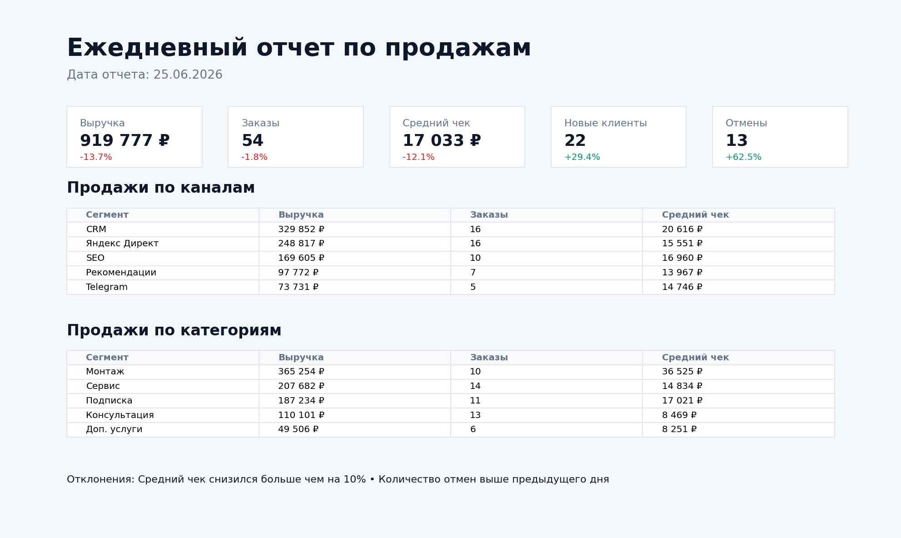

# Ежедневный отчет по продажам

## Описание проекта

Проект демонстрирует автоматизацию ежедневной управленческой отчетности по продажам.

Скрипт каждый день собирает данные по заказам, считает ключевые KPI, сравнивает показатели с предыдущим днем, формирует HTML/PNG-отчет и может отправлять его в Telegram или Email.

---

# Бизнес-задача

У клиента были ежедневные ручные проверки продаж:

- выгрузка заказов из CRM;
- расчет выручки, количества заказов и среднего чека;
- проверка отклонений по каналам продаж;
- отправка итогов руководителю утром.

Из-за ручного процесса отчет часто приходил с задержкой, а просадки по выручке, отменам или среднему чеку замечались уже после начала рабочего дня.

Задача — сделать автоматический ежедневный отчет, который приходит утром без ручных выгрузок и сразу показывает проблемные зоны.

---

# Что было реализовано

Python-скрипт по расписанию:

- забирает данные по заказам;
- фильтрует оплаченные и отмененные заказы;
- считает выручку, количество заказов, средний чек, новых клиентов и отмены;
- сравнивает показатели с предыдущим днем;
- строит разбивку по каналам продаж и категориям;
- формирует список отклонений;
- сохраняет HTML-отчет и PNG-скрин;
- при необходимости отправляет отчет в Telegram или Email.

---

# Скрин отчета



---

# Пример результата

В ежедневный отчет попадают основные KPI:

- выручка;
- количество заказов;
- средний чек;
- новые клиенты;
- отмены;
- продажи по каналам;
- продажи по категориям;
- автоматические предупреждения по отклонениям.

Пример уведомления:

```text
Ежедневный отчет по продажам за 25.06.2026

Выручка: 919 777 ₽ (-13.7% к прошлому дню)
Заказы: 54 (-1.8% к прошлому дню)
Средний чек: 17 033 ₽ (-12.1% к прошлому дню)
Новые клиенты: 22 (+29.4% к прошлому дню)
Отмены: 13 (+62.5% к прошлому дню)

Отклонения:
- Средний чек снизился больше чем на 10%
- Количество отмен выше предыдущего дня
```

---

# Какие боли закрывает решение

## 1. Нет ручных выгрузок

Менеджеру или аналитику не нужно каждое утро открывать CRM, выгружать Excel и собирать показатели вручную.

## 2. Руководитель видит цифры утром

Отчет формируется автоматически по расписанию и приходит в удобный канал: Telegram или Email.

## 3. Отклонения видны сразу

Система подсвечивает проблемы:

- просадка выручки;
- снижение количества заказов;
- падение среднего чека;
- рост отмен;
- слабые каналы продаж.

## 4. Один формат отчета для всей команды

Все смотрят на одни и те же цифры, без разных версий Excel и ручных пересчетов.

## 5. Решение легко масштабировать

Вместо CSV можно подключить CRM, ClickHouse, PostgreSQL, Google Sheets или API рекламной системы.

---

# Как работает система

## 1. Получение данных

В демо-проекте используется файл:

```text
data/sales.csv
```

В реальном проекте источник можно заменить на:

- CRM;
- Google Sheets;
- ClickHouse;
- PostgreSQL;
- API интернет-магазина;
- готовую витрину данных.

## 2. Расчет метрик

Скрипт считает показатели за выбранный день и сравнивает их с предыдущим днем.

Основная логика находится в файле:

```text
src/daily_sales_report.py
```

## 3. Формирование отчета

На выходе создаются файлы:

```text
reports/daily_sales_report_YYYY-MM-DD.html
reports/daily_sales_report_YYYY-MM-DD.png
```

## 4. Отправка отчета

Если заполнены переменные окружения, отчет можно отправить:

- в Telegram;
- на Email.

## 5. Запуск по расписанию

Для автоматического ежедневного запуска добавлен пример GitHub Actions workflow:

```text
.github/workflows/daily_sales_report.yml
```

---

# Технический стек

- Python
- Pandas
- Matplotlib
- Requests
- SMTP
- Telegram Bot API
- GitHub Actions
- CSV / SQL / CRM-источник данных

---

# Структура проекта

```text
.
├── README.md
├── requirements.txt
├── .env.example
├── data
│   └── sales.csv
├── src
│   └── daily_sales_report.py
├── sql
│   └── daily_sales_report_clickhouse.sql
├── assets
│   └── report_preview.png
├── reports
│   ├── daily_sales_report_2026-06-25.html
│   └── daily_sales_report_2026-06-25.png
└── .github
    └── workflows
        └── daily_sales_report.yml
```

---

# Запуск проекта

## 1. Установить зависимости

```bash
pip install -r requirements.txt
```

## 2. Запустить отчет на демо-данных

```bash
python src/daily_sales_report.py \
  --data data/sales.csv \
  --output-dir reports
```

## 3. Запустить отчет за конкретную дату

```bash
python src/daily_sales_report.py \
  --data data/sales.csv \
  --output-dir reports \
  --report-date 2026-06-25
```

## 4. Отправить отчет в Telegram

```bash
python src/daily_sales_report.py \
  --data data/sales.csv \
  --output-dir reports \
  --send-telegram
```

## 5. Отправить отчет на Email

```bash
python src/daily_sales_report.py \
  --data data/sales.csv \
  --output-dir reports \
  --send-email
```

---

# Переменные окружения

Для отправки отчета нужно создать `.env` на основе `.env.example`.

## Telegram

```text
TELEGRAM_BOT_TOKEN=000000000:your_bot_token
TELEGRAM_CHAT_ID=123456789
```

## Email

```text
SMTP_HOST=smtp.gmail.com
SMTP_PORT=587
SMTP_USER=example@gmail.com
SMTP_PASSWORD=app_password
EMAIL_FROM=example@gmail.com
EMAIL_TO=owner@example.com
```

---

# Особенности реализации

## Расчет только по оплаченным заказам

В KPI по выручке, заказам и среднему чеку попадают только оплаченные заказы.

Отмены считаются отдельно, чтобы руководитель видел проблему с качеством заявок или обработкой заказов.

## Автоматический контроль отклонений

Скрипт сам добавляет предупреждения, если:

- выручка снизилась больше чем на 15%;
- количество заказов снизилось больше чем на 15%;
- средний чек снизился больше чем на 10%;
- отмен стало больше, чем в предыдущий день.

## Гибкий источник данных

В демо используется CSV, но архитектура позволяет заменить источник на SQL-запрос или API.

Пример запроса для ClickHouse находится в файле:

```text
sql/daily_sales_report_clickhouse.sql
```

---

# Результат проекта

В результате получился небольшой автоматизированный отчет, который помогает бизнесу:

- ежедневно контролировать продажи;
- быстрее замечать просадки;
- убрать ручную подготовку отчета;
- сократить зависимость от аналитика в ежедневных операционных задачах;
- получать один понятный отчет в Telegram или Email каждое утро.
