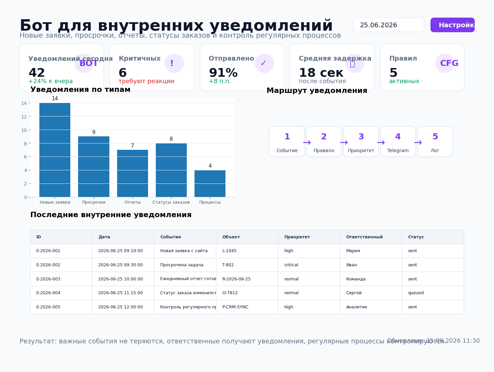
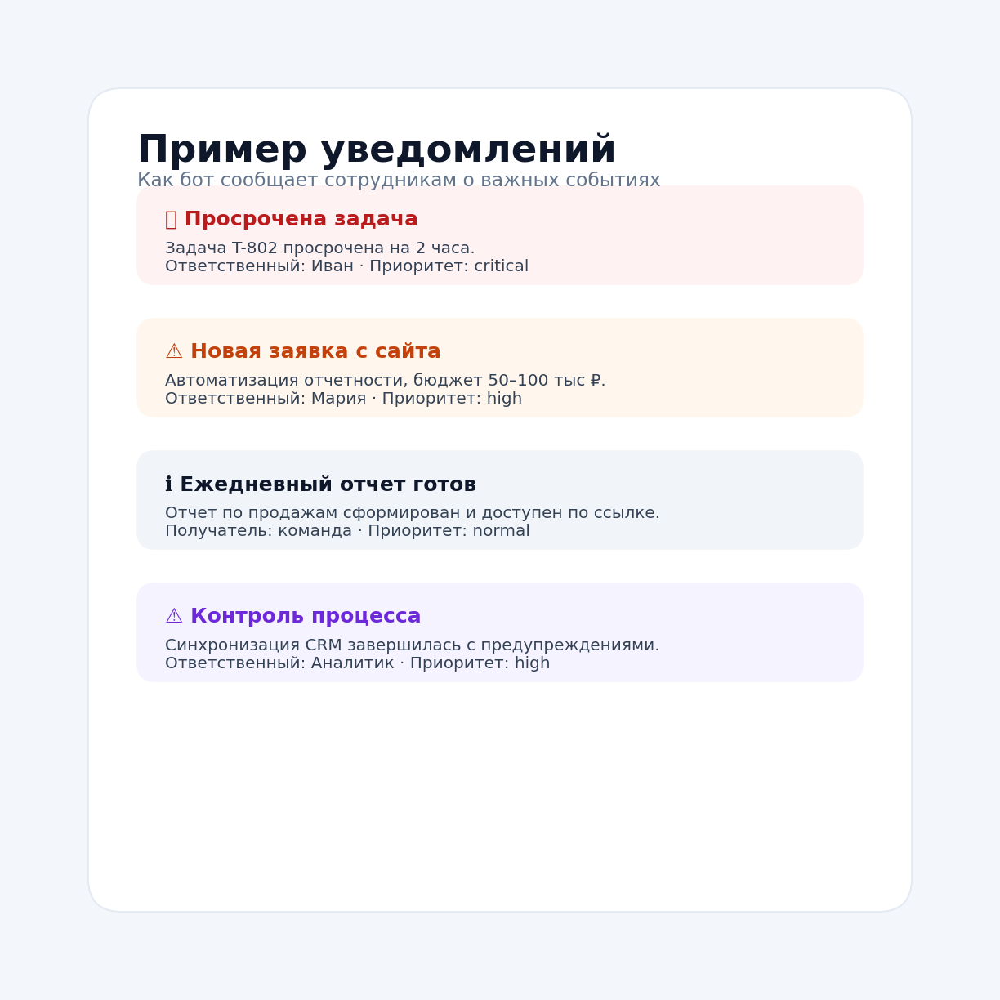

# Бот для внутренних уведомлений



## Задача

В компании есть много событий, которые требуют реакции сотрудников: новые заявки, просрочки, готовность отчетов, смена статусов заказов, ошибки синхронизаций и регулярные проверки процессов.

Когда эти события приходят в разные каналы или проверяются вручную, часть задач теряется, а ответственные узнают о проблеме слишком поздно.

Нужно было сделать бота, который собирает события по правилам, определяет приоритет, отправляет уведомления ответственным и сохраняет историю для контроля.

## Какие боли закрывает

- новые заявки не теряются после отправки формы;
- просрочки и SLA-нарушения сразу уходят ответственным;
- отчеты и регулярные процессы контролируются автоматически;
- менеджеры не проверяют таблицы вручную каждые 30 минут;
- руководитель видит историю отправленных уведомлений;
- можно быстро понять, какие события чаще всего требуют реакции.

## Что делает проект

Скрипт `src/notification_bot.py`:

1. читает события из `data/notification_events.csv`;
2. читает активные правила из `data/notification_rules.csv`;
3. оставляет только события со статусом `queued`;
4. сортирует уведомления по приоритету;
5. формирует текст сообщения;
6. отправляет уведомление в Telegram;
7. при необходимости дублирует событие в webhook;
8. меняет статус события на `sent`;
9. сохраняет сводку для аналитики.

## Результат

| Метрика | Значение |
|---|---:|
| Типов уведомлений | 5 |
| Активных правил | 5 |
| Критичные уведомления | Да |
| Отправка в Telegram | Да |
| Webhook-интеграция | Да |
| История событий | CSV |
| Расписание GitHub Actions | каждые 30 минут |

## Структура проекта

```text
internal_notifications_bot/
├── README.md
├── requirements.txt
├── .env.example
├── data/
│   ├── notification_events.csv
│   ├── notification_rules.csv
│   └── notification_summary.csv
├── src/
│   ├── notification_bot.py
│   ├── storage.py
│   ├── notifier.py
│   ├── create_demo_event.py
│   └── export_summary.py
├── sql/
│   └── internal_notifications_clickhouse.sql
├── assets/
│   ├── report_preview.png
│   └── notification_examples.png
└── .github/
    └── workflows/
        └── internal_notifications.yml
```

## Быстрый запуск

```bash
pip install -r requirements.txt
cp .env.example .env

python src/create_demo_event.py
python src/notification_bot.py
python src/export_summary.py
```

Для отправки в Telegram нужно указать токен бота и chat_id в `.env`.

## Переменные окружения

```text
TELEGRAM_BOT_TOKEN=123456:telegram-token
NOTIFICATION_CHAT_ID=123456789
NOTIFICATION_WEBHOOK_URL=https://example.com/internal-webhook
```

`NOTIFICATION_WEBHOOK_URL` необязателен. Если его не указать, уведомления будут отправляться только в Telegram. Если Telegram-переменные не заданы, демо можно запускать локально без фактической отправки.

## Пример уведомлений



## Пример события

```csv
event_id,created_at,event_type,title,entity_id,priority,responsible,status,channel,message
E-2026-002,2026-06-25 09:30:00,overdue_task,Просрочена задача,T-802,critical,Иван,sent,telegram,Задача просрочена на 2 часа
```

## Пример правила

```csv
rule_id,event_type,description,priority,recipient,enabled
overdue_task,overdue_task,Просрочки по задачам и SLA,critical,manager,1
```

## Что можно доработать в реальном проекте

- подключить CRM, HelpDesk, Google Sheets или ClickHouse как источник событий;
- отправлять разные типы уведомлений в разные чаты;
- добавить кнопки «Взять в работу», «Закрыть», «Отложить»;
- сохранять историю реакций сотрудников;
- добавить антиспам, чтобы не слать повторные уведомления;
- добавить эскалацию руководителю, если просрочка не закрыта;
- построить дашборд по типам событий и времени реакции.

## Стек

- Python
- pandas
- Telegram Bot API
- webhook / CRM API
- ClickHouse SQL
- GitHub Actions
