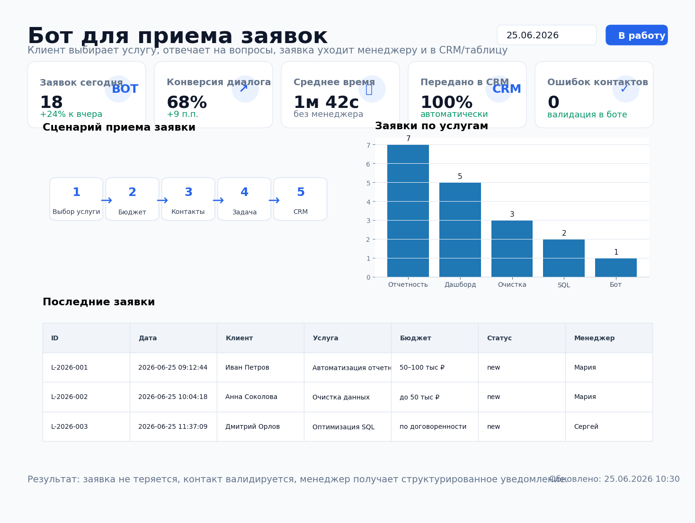
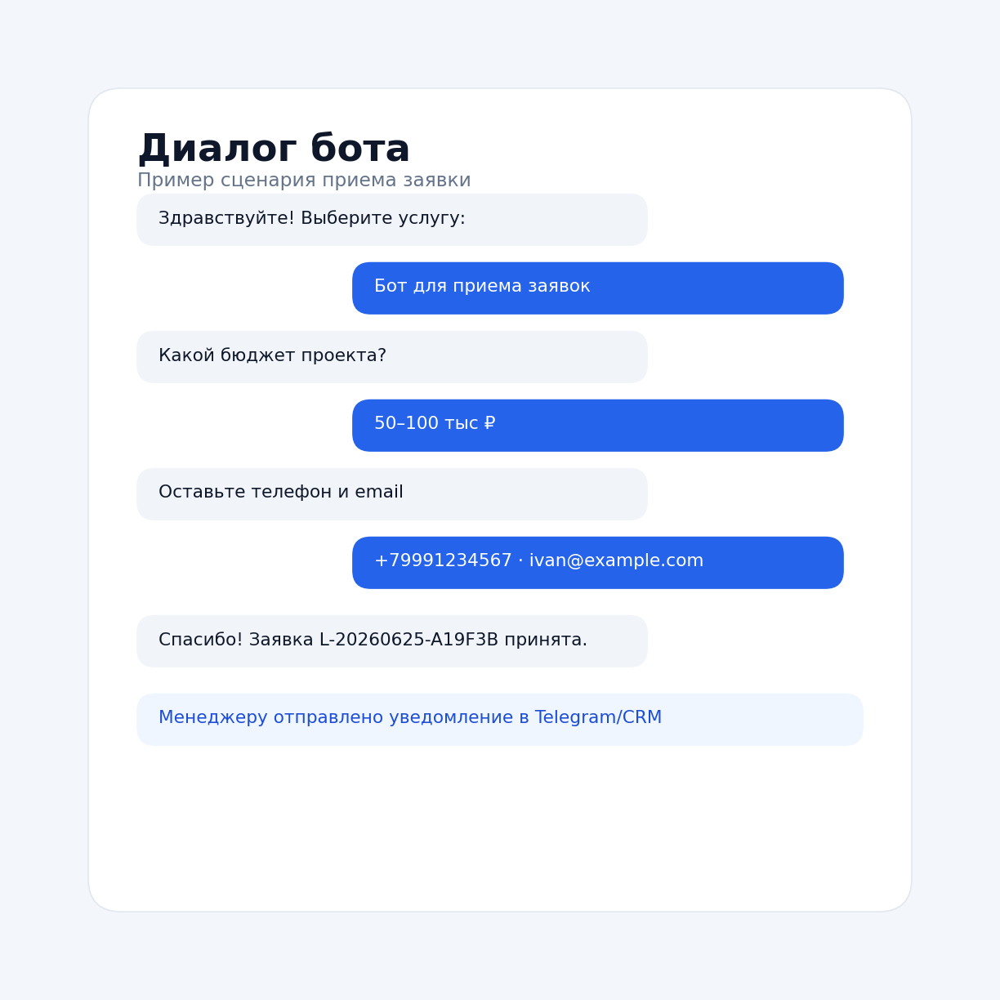

# Бот для приема заявок



## Задача

Клиент оставляет заявку на сайте или в мессенджере, но менеджеру часто приходит неполная информация: нет бюджета, непонятна услуга, контакты указаны с ошибками, часть заявок теряется в переписках.

Нужно было сделать простого бота, который сам задает клиенту вопросы, собирает контактные данные, валидирует ввод и передает заявку менеджеру, в CRM или таблицу.

## Какие боли закрывает

- менеджер не тратит время на первичный сбор информации;
- клиент получает понятный сценарий без длинной формы;
- заявка не теряется в личных сообщениях;
- контакты проверяются до отправки менеджеру;
- все заявки сохраняются в единой структуре для CRM, таблицы и аналитики.

## Что делает проект

Бот собирает заявку по шагам:

1. выбор услуги;
2. выбор бюджета;
3. имя клиента;
4. телефон;
5. email;
6. описание задачи;
7. сохранение заявки в CSV;
8. отправка уведомления менеджеру в Telegram;
9. опциональная отправка заявки в CRM/webhook.

## Результат

| Метрика | Значение |
|---|---:|
| Шагов в сценарии | 6 |
| Валидация телефона | Да |
| Валидация email | Да |
| Сохранение в CSV | Да |
| Уведомление менеджеру | Telegram |
| Интеграция с CRM | Webhook |

## Структура проекта

```text
lead_intake_bot/
├── README.md
├── requirements.txt
├── .env.example
├── data/
│   ├── services.csv
│   ├── leads.csv
│   └── lead_summary.csv
├── src/
│   ├── bot.py
│   ├── storage.py
│   ├── notifier.py
│   ├── export_summary.py
│   └── make_preview.py
├── sql/
│   └── lead_events_clickhouse.sql
├── assets/
│   ├── report_preview.png
│   └── bot_dialog_preview.png
└── .github/
    └── workflows/
        └── bot_demo.yml
```

## Быстрый запуск

```bash
pip install -r requirements.txt
cp .env.example .env
python src/bot.py
```

Для запуска нужен токен Telegram-бота. Его можно получить через BotFather.

## Переменные окружения

```text
TELEGRAM_BOT_TOKEN=123456:telegram-token
MANAGER_CHAT_ID=123456789
LEAD_WEBHOOK_URL=https://example.com/crm/webhook
DEFAULT_MANAGER=Мария
```

`LEAD_WEBHOOK_URL` необязателен. Если его не указать, заявка просто сохранится в CSV и уйдет менеджеру в Telegram.

## Пример диалога



## Как заявка сохраняется

Пример строки в `data/leads.csv`:

```csv
lead_id,created_at,name,phone,email,service,budget,comment,status,manager,source
L-2026-001,2026-06-25 09:12:44,Иван Петров,+79991234567,ivan@example.com,Автоматизация отчетности,50–100 тыс ₽,Нужен ежедневный отчет по продажам в Telegram,new,Мария,telegram_bot
```

## Что можно доработать в реальном проекте

- добавить оплату или предквалификацию лида;
- подключить amoCRM, Bitrix24, Google Sheets или Airtable;
- добавить вебхуки для сайта;
- добавить разные сценарии под разные услуги;
- отправлять менеджеру карточку с кнопками «Взять в работу» и «Закрыть»;
- строить аналитику по источникам заявок и конверсии диалогов.

## Стек

- Python
- aiogram
- pandas
- Telegram Bot API
- webhook / CRM API
- ClickHouse SQL
- GitHub Actions
