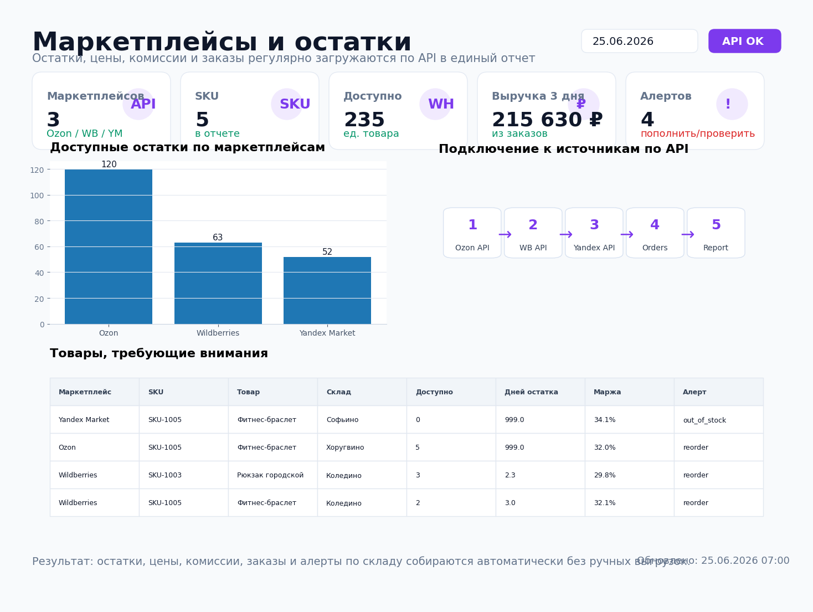
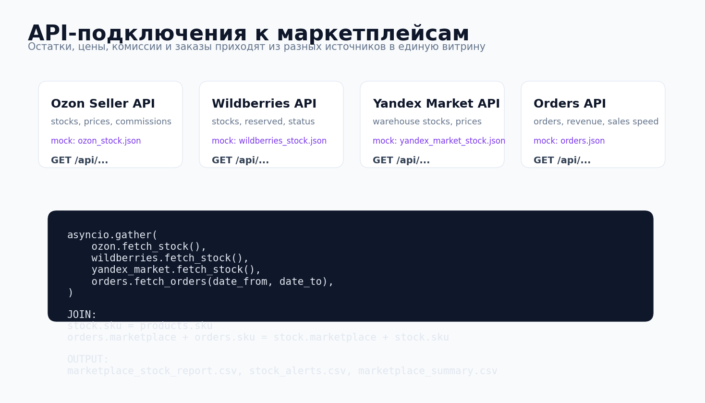
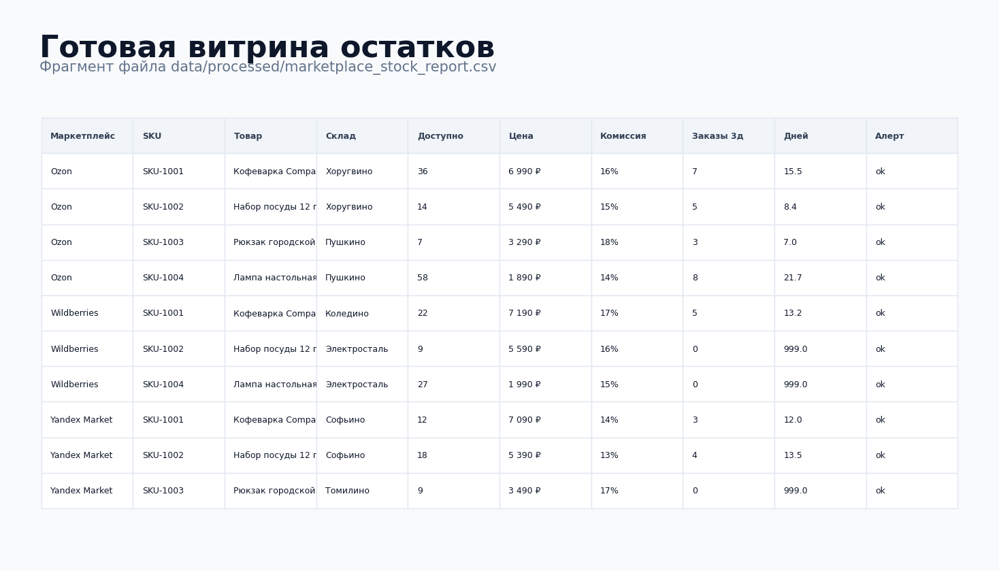

# Маркетплейсы и остатки



## Задача

Заказы, остатки, цены, комиссии и статусы товаров хранились в разных кабинетах маркетплейсов.  
Из-за этого приходилось вручную выгружать отчеты, сводить SKU, проверять остатки и искать товары, которые скоро закончатся.

Нужно было сделать небольшой API-пайплайн, который регулярно подключается к источникам, забирает данные и готовит единую витрину для отчета, учета и контроля склада.

## Какие боли закрывает

- остатки по Ozon, Wildberries и Яндекс Маркету проверяются вручную;
- менеджер поздно видит товары, которые скоро закончатся;
- цены и комиссии сравниваются в разных кабинетах;
- сложно понять, где товар продается быстро, а где залеживается;
- нет единого файла для BI, Google Sheets или управленческого учета;
- невозможно быстро посчитать запас в днях по каждому SKU.

## Что делает проект

Пайплайн `src/pipeline.py`:

1. подключается к Ozon API;
2. подключается к Wildberries API;
3. подключается к Yandex Market API;
4. забирает заказы из Orders API;
5. объединяет данные по `marketplace + sku`;
6. подтягивает справочник товаров и себестоимость;
7. считает доступный остаток, комиссию, чистую цену и маржу;
8. считает средние продажи за 3 дня;
9. рассчитывает запас в днях;
10. формирует алерты `reorder`, `out_of_stock`, `low_margin`.

## Результат на демо-данных

| Метрика | Значение |
|---|---:|
| Источников по API | 4 |
| Маркетплейсов | 3 |
| SKU в отчете | 5 |
| Строк в витрине | 15 |
| Отдельный файл алертов | Да |
| Mock-режим без токенов | Да |
| Расписание GitHub Actions | Да |

## Структура проекта

```text
marketplace_stock_api/
├── README.md
├── requirements.txt
├── .env.example
├── data/
│   ├── mock_api/
│   │   ├── products.json
│   │   ├── ozon_stock.json
│   │   ├── wildberries_stock.json
│   │   ├── yandex_market_stock.json
│   │   └── orders.json
│   └── processed/
│       ├── marketplace_stock_report.csv
│       ├── stock_alerts.csv
│       └── marketplace_summary.csv
├── src/
│   ├── api_clients.py
│   ├── pipeline.py
│   └── export_alerts_to_telegram.py
├── sql/
│   └── marketplace_stock_clickhouse.sql
├── assets/
│   ├── report_preview.png
│   ├── api_sources_preview.png
│   └── stock_table_preview.png
├── tests/
│   └── test_pipeline.py
└── .github/
    └── workflows/
        └── marketplace_stock.yml
```

## Быстрый запуск

```bash
pip install -r requirements.txt
python src/pipeline.py --date-from 2026-06-23 --date-to 2026-06-25
python src/export_alerts_to_telegram.py
```

По умолчанию включен `MOCK_MODE=1`, поэтому проект запускается без реальных API-ключей и читает примеры ответов из `data/mock_api/`.

## Переменные окружения

```text
MOCK_MODE=1

OZON_API_URL=https://api-seller.ozon.example.com
OZON_API_TOKEN=token

WB_API_URL=https://statistics-api.wildberries.example.com
WB_API_TOKEN=token

YANDEX_MARKET_API_URL=https://api.partner.market.yandex.example.com
YANDEX_MARKET_API_TOKEN=token

ORDERS_API_URL=https://shop.example.com/api
ORDERS_API_TOKEN=token

TELEGRAM_BOT_TOKEN=123456:telegram-token
TELEGRAM_CHAT_ID=123456789
```

## API-подключения



## Пример готовой витрины



## Ключевые поля

- `stock` — общий остаток на складе маркетплейса;
- `reserved` — зарезервировано под заказы;
- `available_stock` — доступно к продаже;
- `price` — текущая цена;
- `commission_rate` — комиссия маркетплейса;
- `net_price` — цена после комиссии;
- `gross_margin_rate` — маржинальность;
- `orders_3d` — продажи за 3 дня;
- `days_of_stock` — на сколько дней хватит остатка;
- `alert` — статус контроля: `ok`, `reorder`, `out_of_stock`, `low_margin`.

## Что можно доработать в реальном проекте

- подключить реальные API Ozon, Wildberries и Яндекс Маркета;
- добавить обновление цен по API;
- отправлять алерты в Telegram;
- загружать витрину в ClickHouse;
- строить дашборд в DataLens, Power BI или Looker Studio;
- добавить ABC/XYZ-анализ товаров;
- добавить рекомендации по пополнению склада.

## Стек

- Python
- httpx
- pandas
- API integrations
- ClickHouse SQL
- Telegram Bot API
- GitHub Actions
