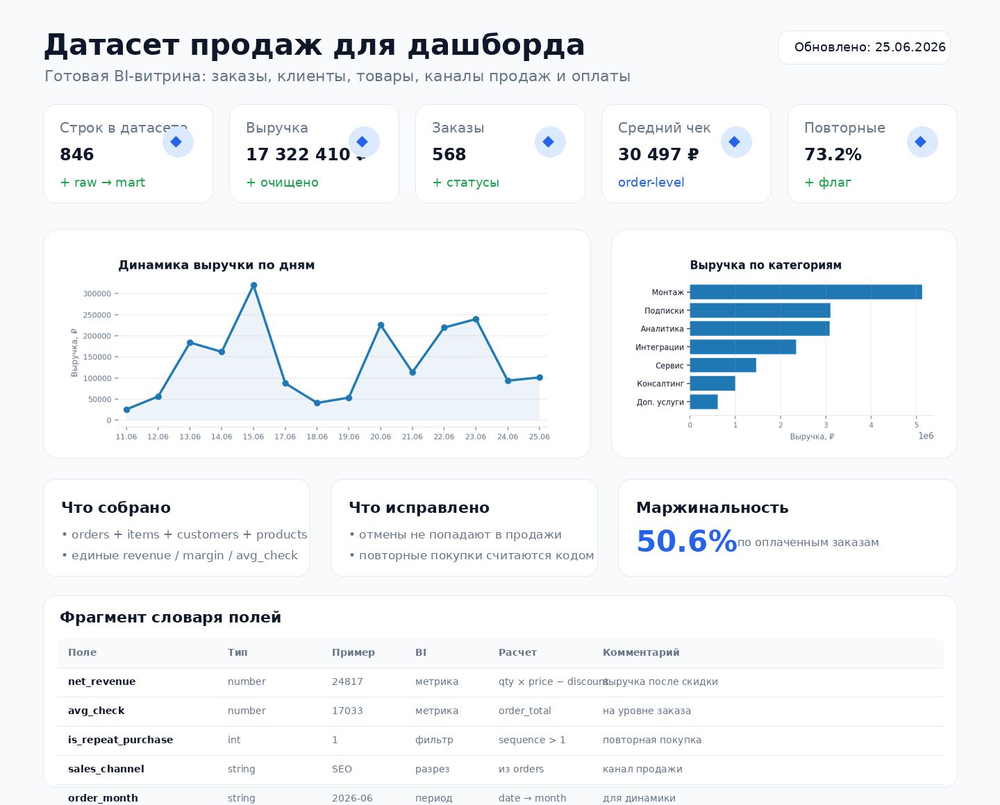
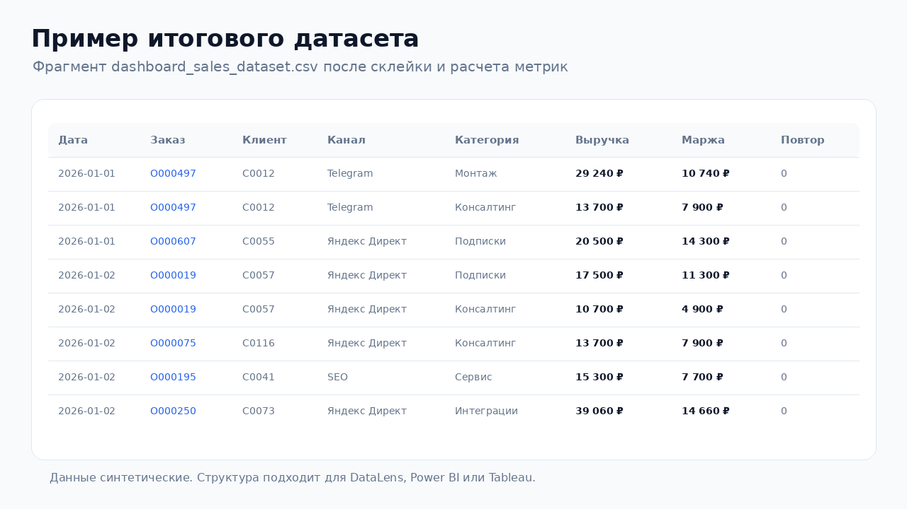

# Датасет продаж для дашборда

Небольшой пример подготовки **BI-витрины продаж** для дашборда.  
Кейс показывает, как из нескольких сырых таблиц собрать единый датасет: заказы, клиенты, товары, каналы продаж и оплаты.





## Задача

Бизнесу нужен дашборд по продажам, но данные лежат в разных таблицах:

- заказы;
- строки заказов;
- клиенты;
- товары и категории;
- каналы продаж;
- способы оплаты и статусы.

Нужно подготовить датасет, который можно сразу подключить к DataLens, Power BI, Tableau или другой BI-системе.

## Какие боли закрывает

- Нет единой таблицы для дашборда: приходится вручную склеивать выгрузки в Excel.
- Выручка, средний чек и маржа считаются по-разному в разных отчетах.
- Отмененные и возвратные заказы могут попадать в продажи и искажать KPI.
- Повторные покупки и динамика по периодам считаются вручную.
- BI-дашборд начинает зависеть от ручных правок и нестабильных формул.

## Что сделано

- Сгенерированы демо-таблицы продаж: `orders`, `order_items`, `customers`, `products`.
- Собрана плоская витрина `dashboard_sales_dataset.csv`.
- Посчитаны поля для BI:
  - `net_revenue` — выручка после скидки;
  - `gross_revenue` — выручка до скидки;
  - `margin` и `margin_pct`;
  - `avg_check`;
  - `order_month`, `order_week`;
  - `is_paid`, `is_cancelled`;
  - `order_sequence`, `is_repeat_purchase`.
- Подготовлены агрегаты для дашборда:
  - ежедневные KPI;
  - метрики по категориям;
  - метрики по клиентам;
  - словарь полей.

## Стек

- Python
- pandas
- CSV
- matplotlib / Pillow для PNG-превью
- SQL / ClickHouse как пример витрины
- GitHub Actions для автоматического пересбора датасета

## Структура проекта

```text
sales_dashboard_dataset/
├── README.md
├── requirements.txt
├── .env.example
├── data/
│   ├── raw/
│   │   ├── customers.csv
│   │   ├── orders.csv
│   │   ├── order_items.csv
│   │   └── products.csv
│   └── processed/
│       ├── dashboard_sales_dataset.csv
│       ├── dashboard_daily_metrics.csv
│       ├── dashboard_category_metrics.csv
│       ├── dashboard_customer_metrics.csv
│       └── data_dictionary.csv
├── src/
│   ├── create_demo_data.py
│   ├── build_dataset.py
│   ├── make_preview.py
│   └── make_dataset_sample_image.py
├── sql/
│   └── sales_dataset_clickhouse.sql
├── assets/
│   ├── report_preview.png
│   └── dataset_sample.png
└── .github/
    └── workflows/
        └── build_sales_dataset.yml
```

## Быстрый запуск

```bash
pip install -r requirements.txt
python src/create_demo_data.py --output-dir data/raw
python src/build_dataset.py --raw-dir data/raw --output-dir data/processed
python src/make_preview.py --processed-dir data/processed --output assets/report_preview.png
python src/make_dataset_sample_image.py --input data/processed/dashboard_sales_dataset.csv --output assets/dataset_sample.png
```

## Какие файлы получаются на выходе

| Файл | Назначение |
|---|---|
| `dashboard_sales_dataset.csv` | Основная детальная витрина для BI. Одна строка = товарная строка заказа. |
| `dashboard_daily_metrics.csv` | Ежедневные KPI: выручка, заказы, клиенты, средний чек, маржинальность. |
| `dashboard_category_metrics.csv` | Выручка, заказы, проданные единицы и маржа по категориям и товарам. |
| `dashboard_customer_metrics.csv` | Метрики по клиентам: первая/последняя покупка, повторность, выручка. |
| `data_dictionary.csv` | Описание ключевых полей датасета. |

## Пример бизнес-логики

```python
# Выручка после скидки
dataset["net_revenue"] = dataset["quantity"] * dataset["unit_price"] * (1 - dataset["discount_pct"])

# Маржа
dataset["margin"] = dataset["net_revenue"] - dataset["cost"]

# Повторная покупка
dataset["is_repeat_purchase"] = (dataset["order_sequence"] > 1).astype(int)
```

## Результат

Получается готовый датасет, который можно использовать как основу для дашборда продаж:

- динамика выручки по дням, неделям и месяцам;
- средний чек и количество заказов;
- выручка по товарам, категориям и каналам;
- анализ повторных покупок;
- контроль отмен, возвратов и маржинальности.

