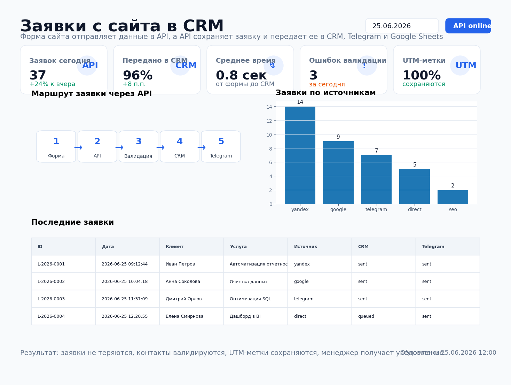
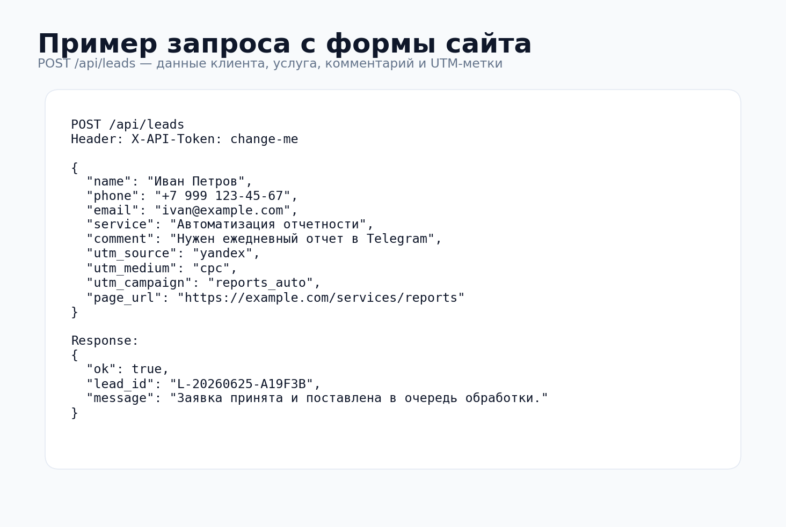
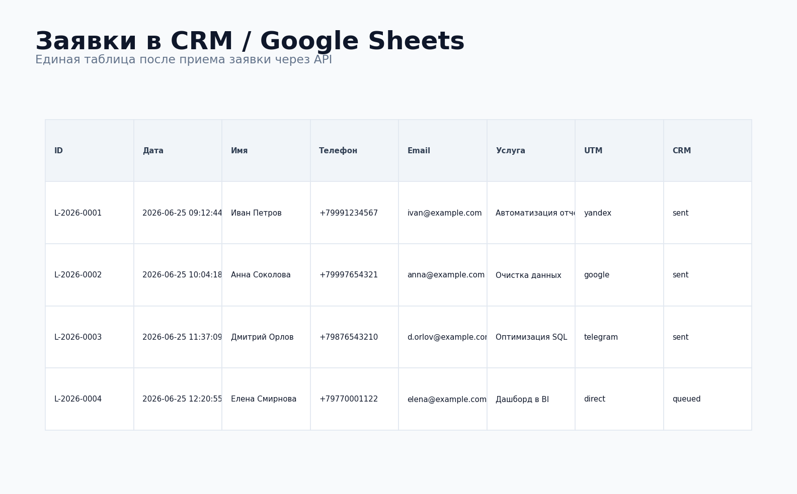

# Заявки с сайта в CRM через API



## Задача

На сайте есть форма заявки, но данные часто теряются между почтой, мессенджерами и таблицами. Менеджеру нужно быстро получить имя, телефон, email, услугу, комментарий и рекламные метки, а заявка должна автоматически попасть в CRM, Google Sheets или Telegram.

Нужно было сделать небольшой API-сервис, который принимает заявки с сайта, валидирует контакты, сохраняет данные и передает их во внешние системы.

## Какие боли закрывает

- заявки не теряются после отправки формы;
- менеджер получает уведомление сразу, а не проверяет почту вручную;
- телефон и email проверяются на уровне API;
- UTM-метки сохраняются вместе с заявкой;
- можно понять, какая реклама приводит заявки;
- одна и та же логика подходит для CRM, таблицы и Telegram.

## Что делает проект

API endpoint `POST /api/leads`:

1. принимает заявку с формы сайта;
2. проверяет обязательные поля;
3. нормализует телефон;
4. сохраняет заявку в CSV;
5. отправляет данные в CRM webhook;
6. отправляет данные в Google Sheets webhook;
7. отправляет уведомление менеджеру в Telegram;
8. возвращает форме сайта номер заявки.

## Результат

| Метрика | Значение |
|---|---:|
| Endpoint для сайта | `POST /api/leads` |
| Валидация телефона | Да |
| Валидация email | Да |
| Сохранение UTM | Да |
| Отправка в CRM | Webhook |
| Отправка в Google Sheets | Webhook |
| Уведомление менеджеру | Telegram |

## Структура проекта

```text
site_leads_api/
├── README.md
├── requirements.txt
├── .env.example
├── data/
│   ├── leads.csv
│   └── leads_summary.csv
├── src/
│   ├── app.py
│   ├── models.py
│   ├── storage.py
│   ├── integrations.py
│   └── export_summary.py
├── sql/
│   └── site_leads_clickhouse.sql
├── assets/
│   ├── report_preview.png
│   ├── api_request_example.png
│   └── crm_table_preview.png
└── tests/
    └── test_validation.py
```

## Быстрый запуск

```bash
pip install -r requirements.txt
cp .env.example .env
uvicorn src.app:app --reload
```

Проверка API:

```bash
curl -X POST http://127.0.0.1:8000/api/leads \
  -H "Content-Type: application/json" \
  -H "X-API-Token: change-me" \
  -d '{
    "name": "Иван Петров",
    "phone": "+7 999 123-45-67",
    "email": "ivan@example.com",
    "service": "Автоматизация отчетности",
    "comment": "Нужен ежедневный отчет в Telegram",
    "utm_source": "yandex",
    "utm_medium": "cpc",
    "utm_campaign": "reports_auto",
    "page_url": "https://example.com/services/reports"
  }'
```

## Пример запроса



## Пример результата в CRM / таблице



## Переменные окружения

```text
CRM_WEBHOOK_URL=https://example.com/crm/webhook
GOOGLE_SHEETS_WEBHOOK_URL=https://script.google.com/macros/s/your-script-id/exec
TELEGRAM_BOT_TOKEN=123456:telegram-token
TELEGRAM_CHAT_ID=123456789
API_TOKEN=change-me
```

## Что можно доработать в реальном проекте

- подключить amoCRM, Bitrix24, HubSpot или retailCRM;
- добавить антиспам и rate limit;
- сохранять заявки в PostgreSQL или ClickHouse;
- добавить retry-очередь при ошибках CRM;
- отправлять разные услуги разным менеджерам;
- построить дашборд по источникам заявок и конверсии.

## Стек

- Python
- FastAPI
- Pydantic
- httpx
- Telegram Bot API
- CRM/Webhook API
- Google Sheets webhook
- ClickHouse SQL
- GitHub Actions
