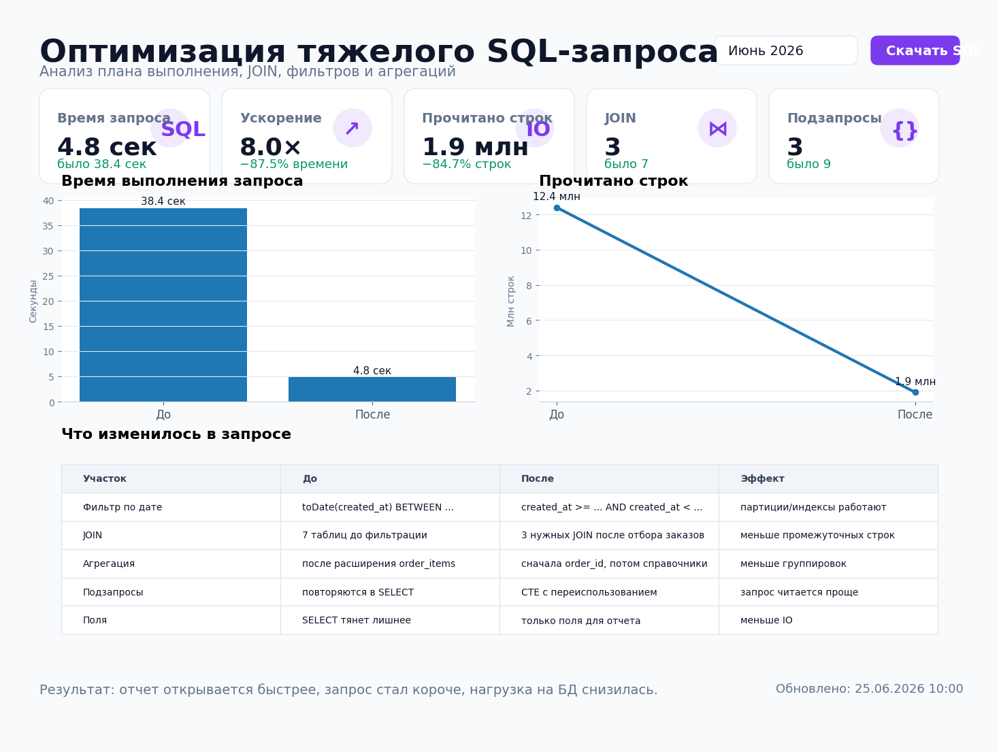

# Оптимизация тяжелого SQL-запроса



## Задача

В отчете по продажам был тяжелый SQL-запрос: он долго открывался, нагружал базу и периодически падал по таймауту.  
Проблема была в лишних `JOIN`, повторных подзапросах, фильтрах по функциям от даты и агрегации большого объема строк до отбора нужного периода.

Нужно было переписать логику так, чтобы отчет открывался быстрее и его можно было безопасно запускать по расписанию.

## Какие боли закрывает

- отчет открывался 30–40 секунд и мешал работе менеджеров;
- база получала лишнюю нагрузку в рабочее время;
- один и тот же расчет повторялся в нескольких подзапросах;
- фильтр по дате не использовал партиционирование;
- аналитик боялся менять запрос, потому что логика была сложной и плохо читаемой.

## Что было сделано

1. Разобрал старый запрос и выделил лишние таблицы.
2. Перенес фильтрацию по датам в самый ранний этап.
3. Убрал функции от поля даты в `WHERE`.
4. Заменил повторные подзапросы на CTE.
5. Сначала агрегировал продажи до уровня `order_id`, потом присоединял справочники.
6. Сократил набор полей, которые протаскивались через весь запрос.
7. Добавил понятную структуру запроса: `params → filtered_orders → order_metrics → final`.

## Результат

| Метрика | До | После |
|---|---:|---:|
| Время выполнения | 38.4 сек | 4.8 сек |
| Прочитано строк | 12.4 млн | 1.9 млн |
| Количество JOIN | 7 | 3 |
| Подзапросов | 9 | 3 |
| Экономия времени | — | 87.5% |

## Структура проекта

```text
sql_query_optimization/
├── README.md
├── requirements.txt
├── data/
│   └── benchmark_results.csv
├── queries/
│   ├── before_heavy_query.sql
│   └── after_optimized_query.sql
├── sql/
│   └── clickhouse_schema.sql
├── src/
│   ├── benchmark_sql.py
│   └── make_preview.py
├── reports/
│   └── optimization_summary.md
├── assets/
│   ├── report_preview.png
│   └── query_comparison.png
└── .github/
    └── workflows/
        └── sql_benchmark.yml
```

## Быстрый запуск

```bash
pip install -r requirements.txt
python src/benchmark_sql.py
python src/make_preview.py
```

Скрипт `benchmark_sql.py` не требует внешней БД. Он создает демо-таблицы в SQLite, запускает тяжелый и оптимизированный варианты запроса и сохраняет сравнение в `data/benchmark_results.csv`.

## Что внутри

- `queries/before_heavy_query.sql` — пример старого тяжелого запроса;
- `queries/after_optimized_query.sql` — переписанная версия;
- `src/benchmark_sql.py` — код для демонстрации подхода и замера времени;
- `sql/clickhouse_schema.sql` — пример схемы таблиц под ClickHouse;
- `assets/report_preview.png` — скрин для сайта;
- `assets/query_comparison.png` — визуальное сравнение до/после.

## Основная идея оптимизации

Плохой паттерн:

```sql
WHERE toDate(created_at) BETWEEN '2026-06-01' AND '2026-06-30'
```

Лучше:

```sql
WHERE created_at >= toDateTime('2026-06-01 00:00:00')
  AND created_at <  toDateTime('2026-07-01 00:00:00')
```

Первый вариант заставляет базу применять функцию к каждой строке.  
Второй вариант дает базе возможность использовать сортировку, партиции и индексы.

## Стек

- SQL
- ClickHouse SQL
- Python
- SQLite для локальной демонстрации
- pandas
- matplotlib
- GitHub Actions
